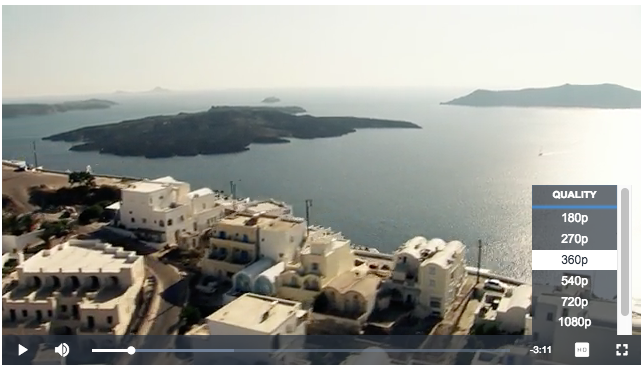

# videojs-hls-quality-selector
[](https://circleci.com/gh/chrisboustead/videojs-hls-quality-selector/tree/master)
[](https://badge.fury.io/js/videojs-hls-quality-selector)

**Note:** v1.x.x is Only compatible with VideoJS 7.x due to the move from `videojs-contrib-hls` to `videojs/http-streaming`.  For VideoJS v5 or v6 support please use a `v0.x.x` tag.

## Description

Adds a quality selector menu for HLS sources played in videojs.  
Requires `videojs-contrib-quality-levels` plugins.

Any HLS manifest with multiple playlists/renditions should be selectable from within the added control.  

**Native HLS**

Does not yet support browsers using native HLS (Safari, Edge, etc).  To enable plugin in browsers with native HLS, you must force non-native HLS playback:



## Table of Contents

<!-- START doctoc generated TOC please keep comment here to allow auto update -->
<!-- DON'T EDIT THIS SECTION, INSTEAD RE-RUN doctoc TO UPDATE -->
## Installation

- [Installation](#installation)
- [Usage](#usage)
  - [`<script>` Tag](#script-tag)
  - [Browserify/CommonJS](#browserifycommonjs)
  - [RequireJS/AMD](#requirejsamd)
- [License](#license)

<!-- END doctoc generated TOC please keep comment here to allow auto update -->
## Installation

```sh
npm install --save videojs-hls-quality-selector
```

## Usage

To include videojs-hls-quality-selector on your website or web application, use any of the following methods.

### `<script>` Tag

This is the simplest case. Get the script in whatever way you prefer and include the plugin _after_ you include [video.js][videojs], so that the `videojs` global is available.

```html
<script src="//path/to/video.min.js"></script>
<script src="//path/to/videojs-hls-quality-selector.min.js"></script>
<script>
  var player = videojs('my-video');

  player.hlsQualitySelector();
</script>
```

### Browserify/CommonJS

When using with Browserify, install videojs-hls-quality-selector via npm and `require` the plugin as you would any other module.

```js
var videojs = require('video.js');

// The actual plugin function is exported by this module, but it is also
// attached to the `Player.prototype`; so, there is no need to assign it
// to a variable.
require('videojs-hls-quality-selector');

var player = videojs('my-video');

player.hlsQualitySelector();
```

### RequireJS/AMD

When using with RequireJS (or another AMD library), get the script in whatever way you prefer and `require` the plugin as you normally would:

```js
require(['video.js', 'videojs-hls-quality-selector'], function(videojs) {
  var player = videojs('my-video');

  player.hlsQualitySelector();
});
```

## License

MIT. Copyright (c) Chris Boustead (chris@forgemotion.com)


[videojs]: http://videojs.com/
